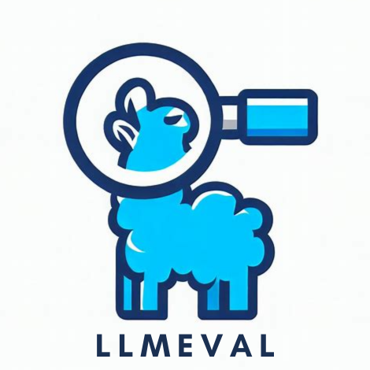

<p align="center">
  
</p>

<h2 align="center">LLMEval-Gaokao2024-Math: LLM Evaluation on 2024 Chinese Gaokao Mathematics</h2>

<p align="center">
  <a href="https://github.com/llmeval"></a>
</p>

> **Note:** For the Chinese version of this README, please refer to [README_zh.md](README_zh.md).

## 🔔 News

- 📊 **[2024-06]** Evaluation results released for the 2024 Gaokao Mathematics papers.

## 📚 Overview

The freshly released Chinese National College Entrance Examination (Gaokao) papers possess high **originality** and **confidentiality**, making them an excellent benchmark for evaluating large language models. The FDU-NLP LLMEval team presents a series of evaluations on the 2024 Gaokao Mathematics papers.

The leaderboard is continuously updated. Results are for reference only.

### Key Features

- **Zero contamination** — brand-new exam questions that models cannot have seen during pre-training
- **Dual prompt formats** — LaTeX and escape-character versions to test prompt sensitivity
- **Two exam papers** — New Paper I (新I卷) and New Paper II (新II卷)
- **Standardized rubrics** — official Gaokao scoring criteria

## 📋 Evaluation Design

Each model is evaluated on both papers using two different prompt formats:

| Paper | Format | Description |
|:------|:-------|:------------|
| New Paper I | LaTeX | Mathematical expressions in standard LaTeX |
| New Paper I | Escape | Mathematical expressions in text-based escape characters |
| New Paper II | LaTeX | Mathematical expressions in standard LaTeX |
| New Paper II | Escape | Mathematical expressions in text-based escape characters |

This dual-format design reveals how sensitive models are to prompt formatting in mathematical contexts.

## 🏆 Results

### New Paper I (新I卷)

Results are available as ranking images in the repository:
- LaTeX format: `新I卷/latex测试/`
- Escape format: `新I卷/转义符测试/`

### New Paper II (新II卷)

- LaTeX format: `新II卷/latex测试/`
- Escape format: `新II卷/转义符测试/`

## 🔗 Related Projects

| Project | Description | Link |
|---------|-------------|------|
| **LLMEval** (AAAI 2024) | Foundational evaluation methodology paper | [arXiv](https://arxiv.org/abs/2312.07398) |
| **LLMEval-Fair** (ACL 2026) | Robust & fair evaluation, 200K+ questions | [GitHub](https://github.com/llmeval/LLMEval-Fair) |
| **LLMEval-Med** (EMNLP 2025) | Medical LLM benchmark | [GitHub](https://github.com/llmeval/LLMEval-Med) |
| **LLMEval-1** | Phase I: General capability evaluation | [GitHub](https://github.com/llmeval/LLMEval-1) |
| **LLMEval-2** | Phase II: Professional domain evaluation | [GitHub](https://github.com/llmeval/LLMEval-2) |
| **Official Website** | All projects & leaderboard | [llmeval.com](http://llmeval.com/) |

## 📝 Citation

```bibtex
@misc{llmeval-gaokao2024-math,
  author = {LLMEval Team},
  title  = {LLMEval-Gaokao2024-Math},
  year   = {2024},
  url    = {https://github.com/llmeval/Llmeval-Gaokao2024-Math}
}
```

## 📞 Contact Us

- **Website**: [http://llmeval.com/](http://llmeval.com/)
- **Email**: mingzhang23@m.fudan.edu.cn
- **WeChat**: zanyingluan

---

<p align="center">
  <b>LLMEval</b> | Fudan University NLP Lab
</p>
