# 测试结果
1、请完成下面一道选择题，每个小题四个选项中，只有一项是符合题目要求的。已知z=-1-i，则|z|=\nA.0 B.1 C.√2 D.2

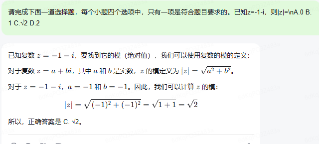

2、请完成下面一道选择题，每个小题四个选项中，只有一项是符合题目要求的。已知命题p:∀A∈R，|x+1|>1，命题q:Ǝx>0，x^3=x，则\nA.p和q都是真命题 B.¬p和q都是真命题\nC.p和¬q都是真命题 D.¬p和¬q都是真命题

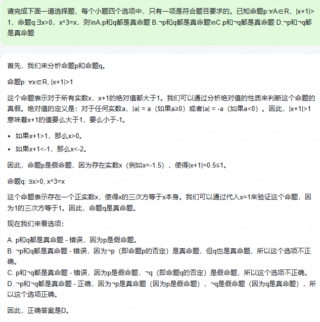

3、请完成下面一道选择题，每个小题四个选项中，只有一项是符合题目要求的。"已知向量a,b满足|a|=1,|a+2b|=2，且(b-2a)⊥b，则|b|=\nA.1/2 B.√2/2 C.√3/2 D.1"

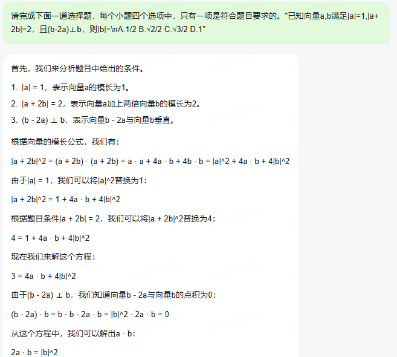

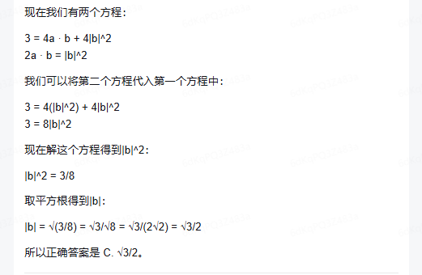

4、某农业研究部门在面积相等的 100 块稻田上种植新型水稻，得到了各块稻田的亩产量（单位：kg）并部分整理如下表所示。\n\n| 亩产量（kg） | 频数 |\n| ------------ | ---- |\n| [900,950)    | 6    |\n| [950,1000)   | 12   |\n| [1000,1050)  | 18   |\n| [1050,1150)  | 24   |\n| [1150,1200)  | 10   |\n\n根据表中数据，下列结论正确的是\n\nA. 100 块稻田亩产量的中位数小于 1050 kg\n\nB. 100 块稻田亩产量低于 1100 kg 的稻田所占比例超过 40%\n\nC. 100 块稻田亩产量的极差介于 200 kg 到 300 kg 之间\n\nD. 100 块稻田亩产量的均值介于 900 kg 到 1000 kg 之间

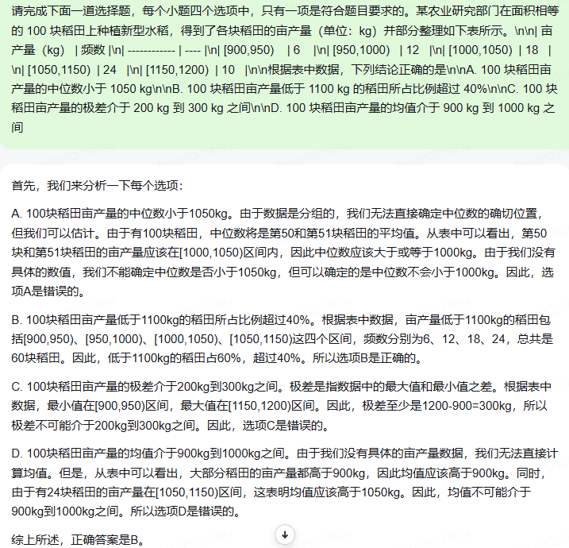

5、请完成下面一道选择题，每个小题四个选项中，只有一项是符合题目要求的。已知曲线C:x^2+y^2=16(y>0)，从C上任意一点P向x轴作垂线段PP'，P'为垂足，则线段PP'的中点M的轨迹方程为\nA.x^2/16+y^2/4=1(y>0) B.x^2/16+y^2/8=1(y>0)\nC.y^2/16+x^2/4=1(y>0) D.y^2/16+x^2/8=1(y>0)

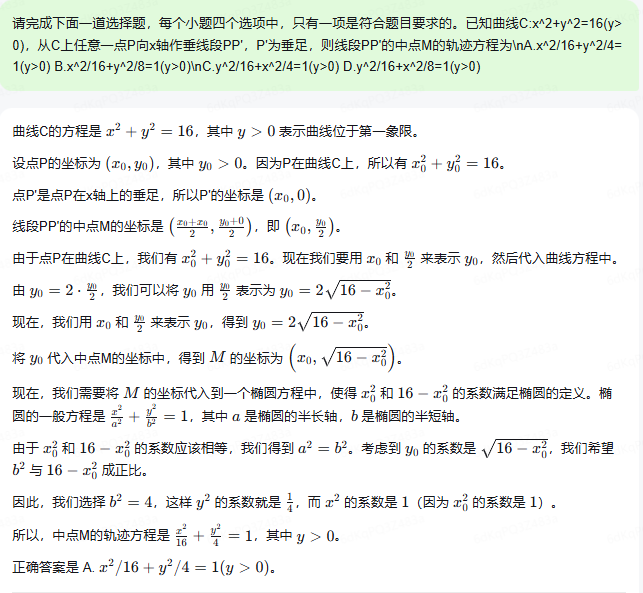

6、请完成下面一道选择题，每个小题四个选项中，只有一项是符合题目要求的。6. 设函数 \\( f(x) = a(x+1)^2 - 1 \\)，\\( g(x) = \\cos x + 2ax \\)（\\( a \\)为常数），当 \\( x \\in (-1, 1) \\) 时，曲线 \\( y = f(x) \\) 和 \\( y = g(x) \\) 恰有一个交点，则 \\( a = \\)（）\n\nA. \\(-1\\)  \nB. \\(\frac{1}{2}\\)  \nC. \\(1\\)  \nD. \\(2\\)\n

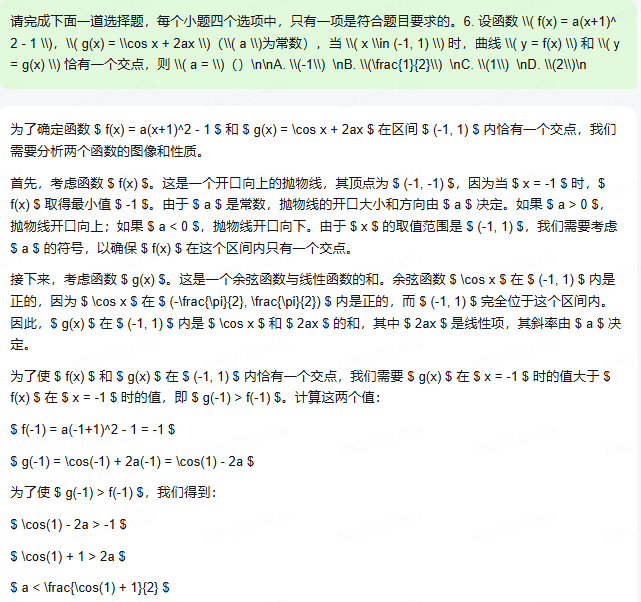
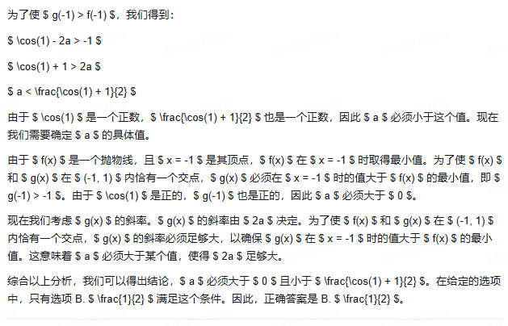

7、请完成下面一道选择题，每个小题四个选项中，只有一项是符合题目要求的。7. 已知正三棱台 \\( ABC - A'B'C' \\) 的体积为 \\(\frac{52}{3}\\)，\\( AB = 6 \\)，\\( A_1B_1 = 2 \\)，则 \\( AA' \\) 与平面 \\( ABC \\) 所成角的正切值为（）\n\nA. \\(\frac{1}{2}\\)  \nB. \\(1\\)  \nC. \\(2\\)  \nD. \\(3\\)\n

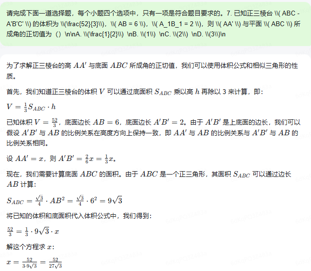
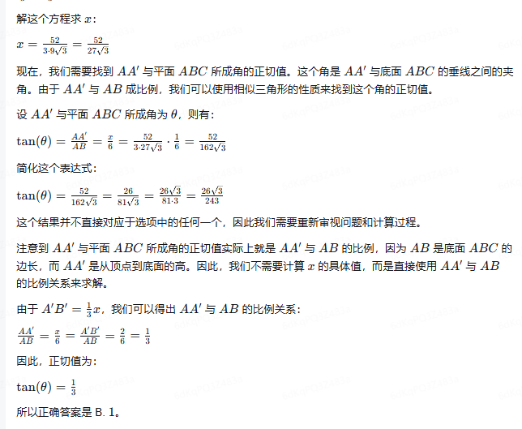

8、请完成下面一道选择题，每个小题四个选项中，只有一项是符合题目要求的。设函数 \\( f(x) = (x + a) \\ln (x + b) \\)，若 \\( f(x) \\geq 0 \\)，则 \\( a^2 + b^2 \\) 的最小值为（）\n\nA. \\(\frac{1}{8}\\)  \nB. \\(\frac{1}{4}\\)  \nC. \\(\frac{1}{2}\\)  \nD. \\(1\\)\n

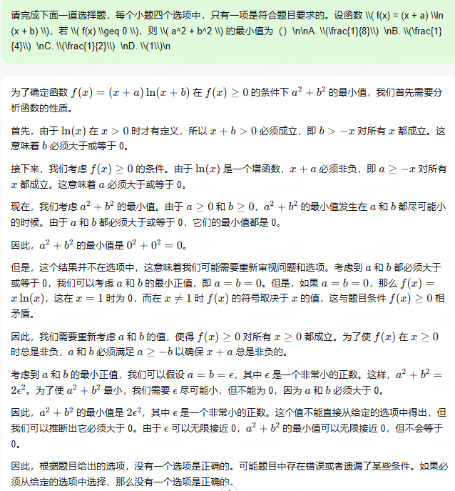

9、请完成下面一道选择题，在每小题给出的选项中，有一项或多项符合题目要求，请选出所有你认为正确的选项。对于函数 \\( f(x) = \\sin 2x \\) 和 \\( g(x) = \\sin (2x - \frac{\\pi}{4}) \\)，下面正确的有：\n\nA. \\( f(x) \\) 和 \\( g(x) \\) 有相同零点  \nB. \\( f(x) \\) 和 \\( g(x) \\) 有相同最大值  \nC. \\( f(x) \\) 和 \\( g(x) \\) 有相同的最小正周期  \nD. \\( f(x) \\) 和 \\( g(x) \\) 有相同的对称轴  \n

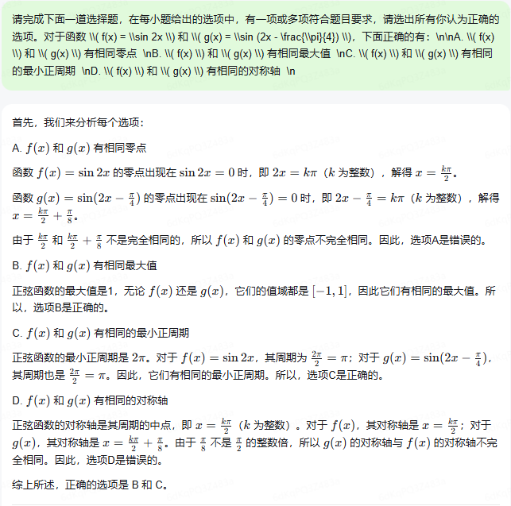

10、请完成下面一道选择题，在每小题给出的选项中，有一项或多项符合题目要求，请选出所有你认为正确的选项。10. 抛物线 \\( C: y^2 = 4x \\) 的准线为 \\( l \\)，\\( P \\) 为 \\( C \\) 上的动点，过 \\( P \\) 作圆 \\( A: x^2 + (y - 4)^2 = 1 \\) 的一条切线，\\( Q \\) 为切点，过 \\( P \\) 作 \\( C \\) 的垂线，垂足为 \\( B \\)，则：\n\nA. \\( l \\) 与圆 \\( A \\) 相切  \nB. 当 \\( P \\)，\\( A \\)，\\( B \\) 三点共线时，\\( |PQ| = \\sqrt{15} \\)  \nC. 当 \\( |PB| = 2 \\) 时，\\( PA \\perp AB \\)  \nD. 满足 \\( |PA| = |PB| \\) 的点 \\( P \\) 有且仅有两个 \n

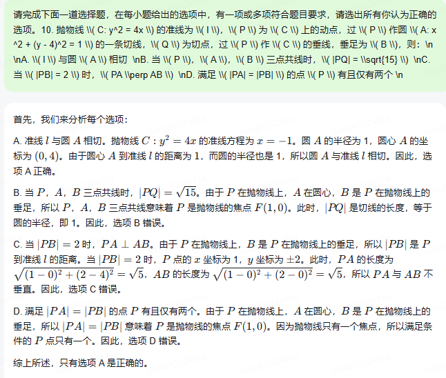

11、请完成下面一道选择题，在每小题给出的选项中，有一项或多项符合题目要求，请选出所有你认为正确的选项。函数 f(x) = 2x^3 - 3ax^2 + 1 ，则：\nA. 当 a > 1 时， f(x) 有三个零点。\nB. 当 a < 0 时 x = 0 是 f(x) 的极大值点。\nC. 存在 a, b，使得 x = b 是曲线 y = f(x) 的对称轴。\nD. 存在 a，使得点 (1, f(1)) 为曲线 y = f(x) 的对称中心。

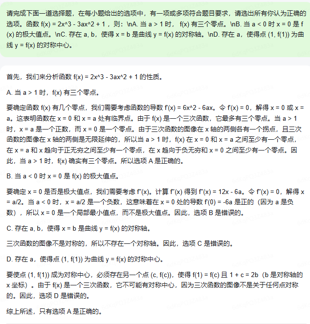

12、记 S_n 为等差数列 {a_n} 的前 n 项和，若a_3 + a_4 = 7，3a_2 + a_5 = 5, 则S_10 = _______

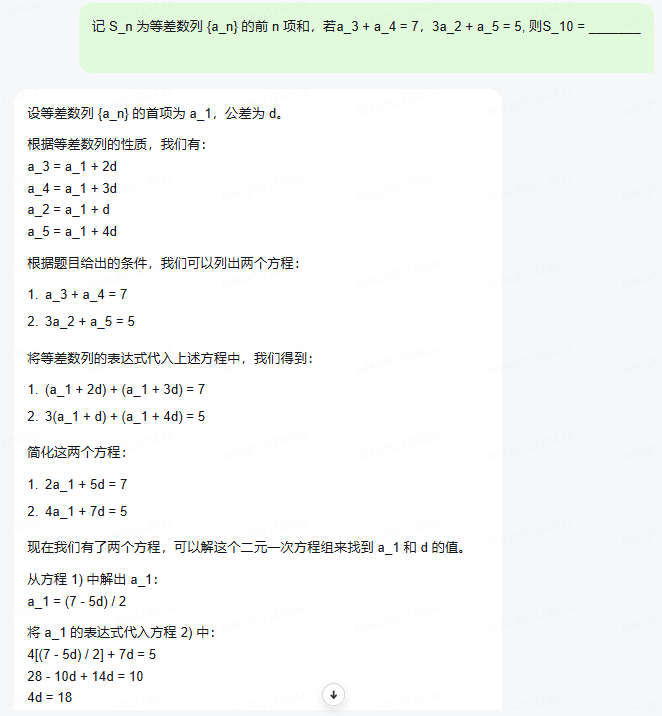

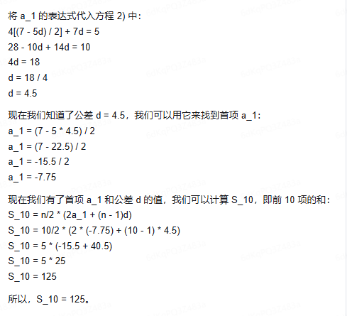

13.已知 α 为第一象限角，β 为第三象限角，tanα + tanβ = 4，tanα · tanβ = √2 + 1则 sin(α + β) = ____

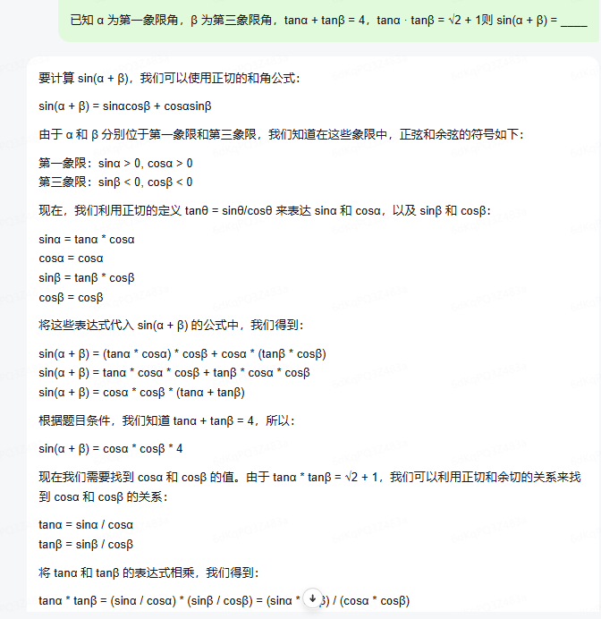

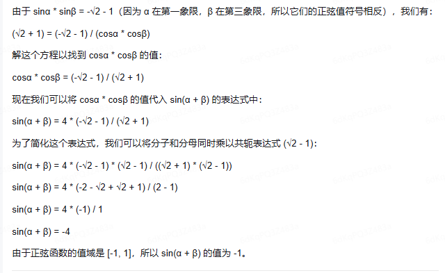

14、在右图的4×4方格表中选4个方格，颜色均均匀分布，要求每行和每列均恰有一个方格被选中，则共有_____种选法，在所有符合上述要求的选择中，选中方格中的4个数之和的最大值是_____

**方格表：**

```
11 21 31 40
12 22 33 42
13 22 33 43
15 24 34 44
```


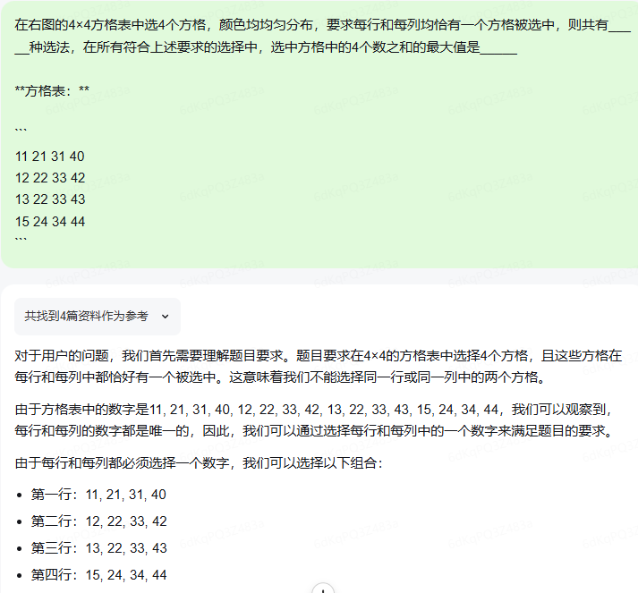

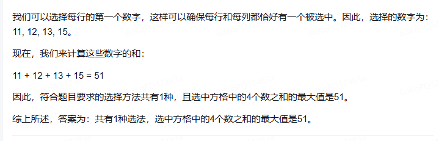

# 得分情况
## 正确答案
C B B C A D B C BC ABD AD 95 -2sqrt{2} /3 24;112
## 模型答案
C D C B A B B ？ BC A A 125 -1 1;51 得分26(35.62%)