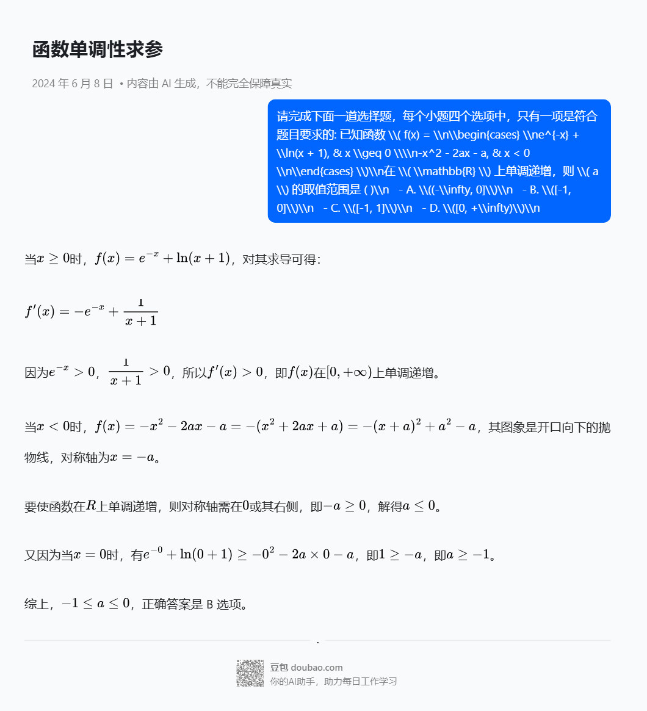
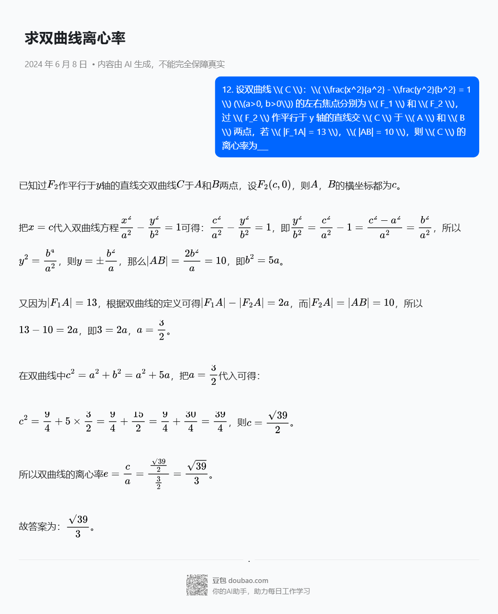

# 测试结果

1、请完成下面一道选择题，每个小题四个选项中，只有一项是符合题目要求的。
已知集合 \( A = \{x \mid -5 < x^3 < 5\} \)，\( B = \{-3, -1, 0, 2, 3\} \)，则 \( A \cap B = \) ( )
   - A. \(\{-1, 0\}\)
   - B. \(\{2, 3\}\)
   - C. \(\{-3, -1, 0\}\)
   - D. \(\{-1, 0, 2\}\)

2、请完成下面一道选择题，每个小题四个选项中，只有一项是符合题目要求的。
若 \( \frac{z}{z-1} = 1 + i \)，则 \( z = \) ( )
   - A. \(-1 - i\)
   - B. \(-1 + i\)
   - C. \(1 - i\)
   - D. \(1 + i\)

3、请完成下面一道选择题，每个小题四个选项中，只有一项是符合题目要求的。
已知向量 \( \vec{a} = (0, 1) \)，\( \vec{b} = (2, x) \)，若 \( \vec{b} \perp (\vec{b} - 4\vec{a}) \)，则 \( x = \) ( )
   - A. \(-2\)
   - B. \(-1\)
   - C. \(1\)
   - D. \(2\)

4、请完成下面一道选择题，每个小题四个选项中，只有一项是符合题目要求的。
已知 \( \cos(\alpha + \beta) = m \)，\( \tan\alpha \tan\beta = 2 \)，则 \( \cos(\alpha - \beta) = \) ( )
   - A. \(-3m\)
   - B. \(-\frac{m}{3}\)
   - C. \(\frac{m}{3}\)
   - D. \(3m\)

5、请完成下面一道选择题，每个小题四个选项中，只有一项是符合题目要求的。
已知圆柱和圆锥的底面半径相等，侧面积相等，且它们的高均为 \(\sqrt{3}\)，则圆锥的体积为 ( )
   - A. \(2\sqrt{3}\pi\)
   - B. \(3\sqrt{3}\pi\)
   - C. \(6\sqrt{3}\pi\)
   - D. \(9\sqrt{3}\pi\)

6、请完成下面一道选择题，每个小题四个选项中，只有一项是符合题目要求的。
已知函数 \( f(x) = 
\begin{cases} 
e^{-x} + \ln(x + 1), & x \geq 0 \\
-x^2 - 2ax - a, & x < 0 
\end{cases} \)
在 \( \mathbb{R} \) 上单调递增，则 \( a \) 的取值范围是 ( )
   - A. \((-\infty, 0]\)
   - B. \([-1, 0]\)
   - C. \([-1, 1]\)
   - D. \([0, +\infty)\)

7、请完成下面一道选择题，每个小题四个选项中，只有一项是符合题目要求的。
当 \( x \in [0, 2\pi] \) 时，曲线 \( y = \sin x \) 与 \( y = 2\sin(3x - \frac{\pi}{6}) \) 的交点个数为 ( )
   - A. 3
   - B. 4
   - C. 6
   - D. 8

8、请完成下面一道选择题，每个小题四个选项中，只有一项是符合题目要求的。
已知函数 \( f(x) \) 的定义域为 \( \mathbb{R} \)，\( f(x) > f(x - 1) + f(x - 2) \)，且当 \( x < 3 \) 时，\( f(x) = x \)，则下列结论中一定正确的是 ( )
   - A. \( f(10) > 100 \)
   - B. \( f(20) > 1000 \)
   - C. \( f(10) < 1000 \)
   - D. \( f(20) < 10000 \)

9、请完成下面一道选择题，在每小题给出的选项中，有一项或多项符合题目要求，请选出所有你认为正确的选项。
为了解推动出口后的亩收入（单位：万元）情况，从该种植区抽取样本，得到推动出口后亩收入的样本均值 \\(\\bar{x} = 2.1\\)，样本方差 \\(S^2 = 0.01\\)，已知该种植区以往的亩收入 \\(x\\) 服从正态分布 \\(N(1.8, 0.1^2)\\)，假设推动出口后的亩收入 \\(Y\\) 服从正态分布 \\(N(\\bar{x}, S^2)\\)，则（若随机变量 \\(Z\\) 服从正态分布 \\(N(u, \\alpha^2)\\)，则 \\(P(Z < u + \\alpha) \\approx 0.8413\\)）： A. \\(P(x > 2) > 0.2\\) B. \\(P(x > 2) < 0.5\\) C. \\(P(Y > 2) > 0.5\\) D. \\(P(Y > 2) < 0.8\\)

10、请完成下面一道选择题，在每小题给出的选项中，有一项或多项符合题目要求，请选出所有你认为正确的选项。
设函数 \\(f(x) = (x-1)^2(x-4)\\)，则： A. \\(x = 3\\) 是 \\(f(x)\\) 的极小值点 B. 当 \\(0 < x < 1\\) 时 \\(f(x) < f(x^2)\\) C. 当 \\(1 < x < 2\\) 时，\\(-4 < f(2x-1) < 0\\) D. 当 \\(-1 < x < 0\\) 时，\\(f(2-x) > f(x)\\)

11、请完成下面一道选择题，在每小题给出的选项中，有一项或多项符合题目要求，请选出所有你认为正确的选项。
某造型可以看作图中的曲线 \\(C\\) 的一部分。已知 \\(C\\) 过坐标原点 \\(O\\)，且 \\(C\\) 上的点满足横坐标大于 \\(-2\\)，到点 \\(F(2,0)\\) 的距离与到定直线 \\(x = a\\) (\\(a < 0\\)) 的距离之积为 4，则： A. \\(a = -2\\) B. 点 \\((2\\sqrt{2}, 0)\\) 在 \\(C\\) 上 C. \\(C\\) 在第一象限的点的纵坐标的最大值为 1 D. 当点 \\((x_0, y_0)\\) 在 \\(C\\) 上时，\\(y_0 \\leq \\frac{4}{x_0 + 2}\\)

12、设双曲线 \\( C \\)：\\( \frac{x^2}{a^2} - \frac{y^2}{b^2} = 1 \\) (\\(a>0, b>0\\)) 的左右焦点分别为 \\( F_1 \\) 和 \\( F_2 \\)，过 \\( F_2 \\) 作平行于 y 轴的直线交 \\( C \\) 于 \\( A \\) 和 \\( B \\) 两点，若 \\( |F_1A| = 13 \\)，\\( |AB| = 10 \\)，则 \\( C \\) 的离心率为___

13、若曲线 \\( y = e^x + x \\) 在点 \\( (0, 1) \\) 处的切线也是曲线 \\( y = \\ln(x + 1) + a \\) 的切线，则 \\( a = \\)____

14、甲、乙两人各有四张卡片，每张卡片上标有一个数字，甲的卡片分别标有数字 1，3，5，7，乙的卡片上分别标有数字 2，4，6，8。两人进行四轮比赛，在每轮比赛中，两人各自从自己持有的卡片中随机选一张，并比较所选卡片的数字的大小，数字大的人得 1 分，数字小的人得 0 分，然后各弃置此轮所选的卡片（弃置的卡片在此后的轮次中不能使用）。则四轮比赛比赛后，甲的得分小于 2 的概率为___

# 得分情况
## 正确答案
A C D A B B C B BC ACD ABD 3/2 ln2 1/2
## 模型答案
A B D A B B B C BD ABC CD √39/3 ln2 41/96
得分：30

